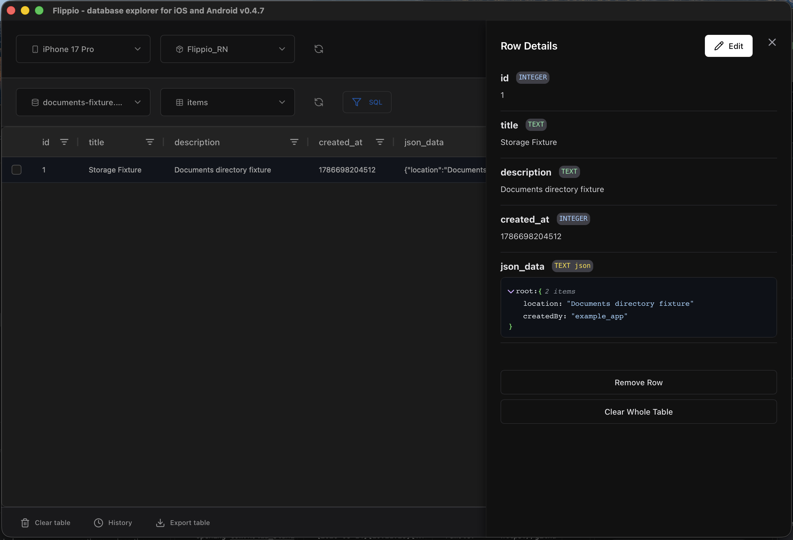

<div align="center">
  <h1>Flippio</h1>
  <p>Inspect and edit SQLite databases from mobile apps and local files.</p>

  
</div>

Flippio is a desktop database browser built for mobile development. It can find an app's databases, show their tables and rows, edit data, run SQL, and sync supported changes back to a device.

## What you can connect

- Android devices and emulators
- iOS simulators
- Physical iOS devices
- Local `.db`, `.db3`, `.sqlite`, `.sqlite3`, and `.sqlitedb` files

Private app data is subject to the platform's access rules. Android apps normally need to be debuggable for `run-as` access. Physical iOS access depends on the app container and services exposed by the device.

## Main features

- Browse installed apps and discover their database files
- Inspect schemas, tables, rows, JSON values, and BLOB data
- Insert, update, and delete rows
- Run custom SQL queries
- Refresh a database without losing the current table selection
- Push supported edits back to Android and iOS devices
- Open SQLCipher databases with a passphrase
- Export database files and use light or dark mode

## Install

Download the latest signed macOS build from [GitHub Releases](https://github.com/groot007/flippio/releases). Current automated releases are universal macOS builds for Apple silicon and Intel Macs.

After installation, make sure the tools for your target platform are available:

- Android: Android SDK Platform Tools, with `adb` on `PATH`; enable USB debugging and accept the computer authorization prompt.
- iOS simulator: Xcode and its command-line tools; start the simulator before opening Flippio.
- Physical iOS device: connect and trust the Mac, then accept any pairing prompts.

## Typical workflow

1. Start a device or connect it by USB.
2. Select the device, then the app.
3. Select a discovered database and table.
4. Inspect or edit rows, or open the SQL query window.
5. Use refresh to pull the latest file. Row edits made through the grid are synced automatically when the platform permits it.

Custom SQL runs against the active local copy. Export or use the structured row editor when a device-backed write must be pushed automatically.

Use the folder button to inspect a local database without selecting a device or app.

> Back up important databases before editing them. A running mobile app may overwrite changes or keep related data in WAL files.

## SQLCipher databases

When a file cannot be opened as plain SQLite, Flippio asks for its SQLCipher passphrase. A valid key is remembered in memory for the current app session and is not written to disk.

The current unlock flow targets standard SQLCipher passphrase databases. Databases using custom cipher compatibility settings, raw keys, or a custom plaintext-header configuration may require matching configuration that Flippio does not yet expose.

## Troubleshooting

### A device is missing

- Android: run `adb devices`. The device should be listed as `device`, not `offline` or `unauthorized`.
- iOS simulator: run `xcrun simctl list devices` and confirm a simulator is `Booted`.
- Physical iOS: reconnect the cable, unlock the device, and confirm the trust/pairing prompts.

### An app or database is missing

- Confirm that the app is installed for the selected device.
- Open the app once so it creates its database.
- Refresh the list. Physical iOS scans may add results progressively.
- Android private storage usually requires a debuggable app.

### Changes do not reach the device

- Keep the target app closed while pushing changes; an active app can overwrite the file.
- Confirm the remote app container is writable.
- Reopen or refresh the database after reconnecting a device.
- Some protected, production, and system apps cannot be modified.

### A database will not open

- Confirm it is a SQLite or SQLCipher database rather than an unrelated file with a database extension.
- For SQLCipher, retry the exact passphrase used by the app.
- Copy the file together with its `-wal` and `-shm` files when recent writes appear to be missing.

## Build from source

Development requires Node.js 20+, Rust stable, and the Tauri v2 prerequisites for macOS.

```bash
git clone https://github.com/groot007/flippio.git
cd flippio
npm install
npm run tauri:dev
```

Create a production build with:

```bash
npm run tauri:build
```

See [development setup](docs/guides/development-setup.md) for validation commands and [build and deployment](docs/guides/build-and-deployment.md) for the release process.

## Contributing

Issues and focused pull requests are welcome. Please include the affected platform, device type, reproduction steps, and relevant logs for device-connection bugs.
