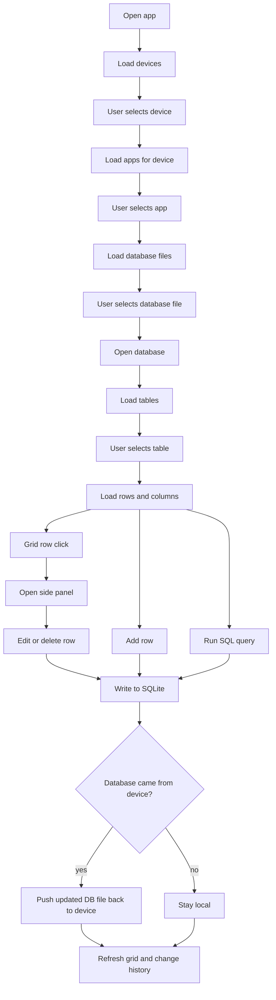

# Flippio User Flow Schema Overview

This guide explains Flippio from the user's perspective first, then shows what happens under the hood in the React app, the Tauri bridge, and Rust commands.

## 1. High-level mental model

Flippio is a staged pipeline:

1. User chooses a device.
2. Flippio loads apps for that device.
3. User chooses an app.
4. Flippio finds database files for that app.
5. User chooses a database file.
6. Flippio opens the database and loads table names.
7. User chooses a table.
8. Flippio loads rows into the grid.
9. User edits, adds, deletes, clears, queries, exports, or refreshes.
10. If the database came from a device, Flippio pushes the changed file back to the device.

## 2. Main screen structure

The main page is assembled in [src/renderer/src/pages/Main.tsx](/Users/mykolastanislavchuk/Home/Flippio/src/renderer/src/pages/Main.tsx:8):

- `AppHeader`: device and app selection
- `SubHeader`: database and table selection, SQL, open/export, refresh
- `DataGrid`: table rows
- `SidePanel`: row details and row editing drawer

## 3. Core state stores

Flippio keeps current selection in small Zustand stores:

- [src/renderer/src/store/useCurrentDeviceSelection.ts](/Users/mykolastanislavchuk/Home/Flippio/src/renderer/src/store/useCurrentDeviceSelection.ts:1)
  - `selectedDevice`
  - `selectedApplication`
- [src/renderer/src/store/useCurrentDatabaseSelection.ts](/Users/mykolastanislavchuk/Home/Flippio/src/renderer/src/store/useCurrentDatabaseSelection.ts:1)
  - `selectedDatabaseFile`
  - `selectedDatabaseTable`
- [src/renderer/src/store/useRowEditingStore.ts](/Users/mykolastanislavchuk/Home/Flippio/src/renderer/src/store/useRowEditingStore.ts:1)
  - `selectedRow`

Rule of thumb: when an upstream selection changes, downstream selections are cleared.

Example:

- Changing device clears app, database file, table, row, and current grid data.
- Changing app clears database file, table, row, and current grid data.
- Changing database clears table, row, and current grid data.

## 4. End-to-end user flow

## 5. What each user action triggers

### 5.1 App opens

User sees:

- Header, subheader, empty grid

Under the hood:

- `Main` renders `AppHeader`, `SubHeader`, `DataGrid`, and `SidePanel`.
- `AppHeader` calls `useDevices()`.
- `useDevices()` calls `window.api.getDevices()`.
- The Tauri bridge combines Android devices, iOS physical devices, and booted iOS simulators in [src/renderer/src/tauri-api.ts](/Users/mykolastanislavchuk/Home/Flippio/src/renderer/src/tauri-api.ts:400).

### 5.2 User selects a device

UI entry point:

- [src/renderer/src/components/layout/AppHeader.tsx](/Users/mykolastanislavchuk/Home/Flippio/src/renderer/src/components/layout/AppHeader.tsx:374)

What happens:

1. `setSelectedDevice(value)`
2. Clear `selectedApplication`
3. Clear `selectedDatabaseFile`
4. Clear `selectedDatabaseTable`
5. Clear current grid data
6. Clear selected row

Then:

- `useApplications(selectedDevice)` becomes enabled.
- `fetchApplicationsForDevice()` chooses the backend call by device type:
  - iOS simulator: `window.api.getIOSPackages`
  - iOS physical device: `window.api.getIOsDevicePackages`
  - Android or emulator: `window.api.getAndroidPackages`

### 5.3 User selects an app

UI entry point:

- [src/renderer/src/components/layout/AppHeader.tsx](/Users/mykolastanislavchuk/Home/Flippio/src/renderer/src/components/layout/AppHeader.tsx:388)

What happens:

1. `setSelectedApplication(value)`
2. Clear `selectedDatabaseFile`
3. Clear `selectedDatabaseTable`
4. Clear current grid data
5. Clear selected row

Then:

- `SubHeader` calls `useDatabaseFiles(selectedDevice, selectedApplication)`.
- `fetchDatabaseFilesForSelection()` chooses the backend call by device type:
  - Android: `window.api.getAndroidDatabaseFiles`
  - iOS simulator: `window.api.getIOSSimulatorDatabaseFiles`
  - iOS physical device: `window.api.getIOSDeviceDatabaseFiles`

Special iPhone-device behavior:

- Physical iPhone scanning is streaming.
- `useDatabaseFiles()` listens to the Tauri event `ios-db-scan-progress`.
- The first scan wave marks the Documents phase complete, then more folders may continue streaming in.
- Previous scans are canceled with `window.api.cancelIOSDeviceDatabaseScan(scanKey)` when selection changes or refresh restarts.

### 5.4 User selects a database file

UI entry point:

- [src/renderer/src/components/layout/SubHeader.tsx](/Users/mykolastanislavchuk/Home/Flippio/src/renderer/src/components/layout/SubHeader.tsx:105)

What happens:

1. `ensureActiveDatabaseFile(...)` makes sure the temporary pulled file still exists.
2. `window.api.switchDatabase(resolvedFile.path)` performs backend cleanup for database switching.
3. `setSelectedDatabaseFile(resolvedFile)`
4. Clear `selectedDatabaseTable`
5. Clear current grid data
6. Clear selected row

Then:

- `useDatabaseTables(selectedDatabaseFile, selectedDevice)` becomes enabled.
- It calls:
  - `window.api.openDatabase(dbPath)`
  - `window.api.getTables(dbPath)`

Rust commands:

- `db_open`
- `db_get_tables`

### 5.5 User opens a local database file

UI entry point:

- `Open` button in `SubHeader`

What happens:

1. `window.api.openFile()` opens the file picker.
2. Flippio stores the selected file as a `desktop` database file.
3. `SubHeader` clears `selectedDevice` and `selectedApplication`.
4. The app now behaves as a local-file workflow instead of a device workflow.

This is why desktop file usage bypasses device and app requirements.

### 5.6 User selects a table

UI entry point:

- [src/renderer/src/components/layout/SubHeader.tsx](/Users/mykolastanislavchuk/Home/Flippio/src/renderer/src/components/layout/SubHeader.tsx:139)

What happens:

1. `setTableData({ rows: [], columns: [], tableName })` to force loading state
2. `setSelectedDatabaseTable(table)`

Then:

- `useTableDataQuery(selectedDatabaseTable?.name)` runs.
- It uses `ensureActiveDatabaseFile(...)` again before reading rows.
- It calls `window.api.getTableInfo(tableName, dbPath)`.
- If the temp file disappeared, it force-refreshes database files and retries.

Rust command:

- `db_get_table_data`

### 5.7 User views rows in the grid

UI entry point:

- [src/renderer/src/components/data/DataGrid.tsx](/Users/mykolastanislavchuk/Home/Flippio/src/renderer/src/components/data/DataGrid.tsx:28)

What happens:

- `DataGrid` reads `tableData` from the store.
- When `useTableDataQuery()` resolves, rows and columns are copied into the table-data store.
- AG Grid renders the rows.
- Empty states are derived from missing upstream selections:
  - no device/app
  - no database
  - no table

### 5.8 User clicks a row

UI entry point:

- [src/renderer/src/components/data/DataGrid.tsx](/Users/mykolastanislavchuk/Home/Flippio/src/renderer/src/components/data/DataGrid.tsx:165)

What happens:

- `setSelectedRow({ rowData, columnInfo })`
- `SidePanel` opens because `selectedRow` is now truthy.

### 5.9 User edits and saves a row

UI entry points:

- [src/renderer/src/components/SidePanel/RowEditor.tsx](/Users/mykolastanislavchuk/Home/Flippio/src/renderer/src/components/SidePanel/RowEditor.tsx:33)
- [src/renderer/src/components/SidePanel/RowEditor.tsx](/Users/mykolastanislavchuk/Home/Flippio/src/renderer/src/components/SidePanel/RowEditor.tsx:48)

What happens:

1. Copy selected row data into local `editedData`
2. Validate values with `validateRowData(...)`
3. Build a `WHERE` condition with `buildUniqueCondition(...)`
4. Call `window.api.updateTableRow(...)`
5. If the DB belongs to a device, call `window.api.pushDatabaseFile(...)`
6. Refetch table data
7. Refresh change history
8. Keep the drawer open with updated row data

Rust commands involved:

- `db_update_table_row`
- device-specific push command:
  - Android: `adb_push_database_file`
  - iOS device: `device_push_ios_database_file`
  - iOS simulator: `upload_simulator_ios_db_file`

### 5.10 User adds a row

UI entry point:

- floating `+` button in [src/renderer/src/components/data/DataGrid.tsx](/Users/mykolastanislavchuk/Home/Flippio/src/renderer/src/components/data/DataGrid.tsx:87)

What happens:

1. Build change-history context from current selection
2. Call `window.api.addNewRowWithDefaults(...)`
3. If needed, push the DB file back to the device
4. Refetch table data
5. Refresh change history

Rust command:

- `db_add_new_row_with_defaults`

### 5.11 User deletes a row

UI entry point:

- `Remove Row` button in `SidePanel`

What happens:

1. `useDeleteRowMutation()` runs through `useBaseDatabaseMutation()`
2. Build unique row condition from original row values
3. Call `window.api.deleteTableRow(...)`
4. If needed, `useBaseDatabaseMutation()` pushes the changed DB back to the device
5. Refresh database data
6. Refresh change history
7. Close the side panel

Rust command:

- `db_delete_table_row`

### 5.12 User clears a whole table

UI entry point:

- `Clear Whole Table` button in `SidePanel`

What happens:

1. `useClearTableMutation()` runs through `useBaseDatabaseMutation()`
2. Call `window.api.clearTable(...)`
3. If needed, push the changed DB back to the device
4. Refresh database data
5. Refresh change history
6. Close the side panel

Rust command:

- `db_clear_table`

### 5.13 User runs a SQL query

UI entry point:

- `SQL` button in `SubHeader`

What happens:

- Opens `CustomQueryModal`
- Executes `window.api.executeQuery(query, dbPath)`
- Stores the result as `tableData.isCustomQuery = true`
- The clear button in the header resets back to standard table-row view

Rust command:

- `db_execute_query`

### 5.14 User refreshes

There are two refresh styles.

Device refresh in `AppHeader`:

- Refetch devices
- If current device still exists, refetch apps
- If current app still exists, refetch database files
- Try to keep the selection alive if matching items still exist
- Otherwise clear invalid selections

Database refresh in `SubHeader`:

- Calls `refreshDatabase(...)`
- Refetches database files, tables, and current table data
- For physical iPhone devices, Flippio clears current DB/table first and restarts the scan flow

### 5.15 User exports a database

UI entry point:

- `Export` button in `SubHeader`

What happens:

1. `window.api.exportFile(...)`
2. Save the currently selected DB file to a user-chosen path

This is file export only. It does not change current app state.

## 6. Frontend architecture by responsibility

### Components

- `AppHeader`: device and app selection
- `SubHeader`: database and table selection, SQL, open/export, refresh
- `DataGrid`: row display, add-row entry point, row selection
- `SidePanel`: row view/edit/delete/clear

### Hooks

- `useDevices()`: load devices
- `useApplications()`: load apps for selected device
- `useDatabaseFiles()`: load DB files for selected device+app
- `useDatabaseTables()`: load table names for selected DB
- `useTableDataQuery()`: load rows for selected table
- `useDeleteRowMutation()` and `useClearTableMutation()`: write actions with shared refresh and push-back behavior

### Shared helpers

- `ensureActiveDatabaseFile(...)`
  - protects against stale pulled temp files
  - can refetch file lists and remap the selected DB file
- `refreshDatabase(...)`
  - standard refetch helper for files, tables, and rows

## 7. Tauri bridge role

The frontend never talks directly to Rust functions. It goes through `window.api` in [src/renderer/src/tauri-api.ts](/Users/mykolastanislavchuk/Home/Flippio/src/renderer/src/tauri-api.ts:1).

That layer is responsible for:

- validating inputs
- choosing the correct backend command by device type
- normalizing response shapes
- exposing one consistent API to React components and hooks

## 8. Rust backend role

Tauri commands are registered in [src-tauri/src/main.rs](/Users/mykolastanislavchuk/Home/Flippio/src-tauri/src/main.rs:80).

Database reads are implemented in [src-tauri/src/commands/database/commands.rs](/Users/mykolastanislavchuk/Home/Flippio/src-tauri/src/commands/database/commands.rs:1).

Important backend behavior:

- `db_open` uses a connection cache
- `db_get_tables` reads SQLite schema from `sqlite_master`
- `db_get_table_data` validates the table exists, reads column metadata, then reads all rows
- write commands also integrate change-history tracking

## 9. The most important sequencing rule in this codebase

Most bugs in Flippio come from stale selection state.

The intended dependency chain is:

`device -> app -> database file -> table -> rows -> selected row`

If something on the left changes, everything on the right must be treated as potentially invalid and usually cleared or refetched.

## 10. Short version

If you want to understand the app quickly, read it in this order:

1. [src/renderer/src/pages/Main.tsx](/Users/mykolastanislavchuk/Home/Flippio/src/renderer/src/pages/Main.tsx:8)
2. [src/renderer/src/components/layout/AppHeader.tsx](/Users/mykolastanislavchuk/Home/Flippio/src/renderer/src/components/layout/AppHeader.tsx:17)
3. [src/renderer/src/components/layout/SubHeader.tsx](/Users/mykolastanislavchuk/Home/Flippio/src/renderer/src/components/layout/SubHeader.tsx:24)
4. [src/renderer/src/components/data/DataGrid.tsx](/Users/mykolastanislavchuk/Home/Flippio/src/renderer/src/components/data/DataGrid.tsx:28)
5. [src/renderer/src/components/SidePanel/SidePanel.tsx](/Users/mykolastanislavchuk/Home/Flippio/src/renderer/src/components/SidePanel/SidePanel.tsx:16)
6. [src/renderer/src/hooks/useDevices.ts](/Users/mykolastanislavchuk/Home/Flippio/src/renderer/src/hooks/useDevices.ts:1)
7. [src/renderer/src/hooks/useApplications.ts](/Users/mykolastanislavchuk/Home/Flippio/src/renderer/src/hooks/useApplications.ts:22)
8. [src/renderer/src/hooks/useDatabaseFiles.ts](/Users/mykolastanislavchuk/Home/Flippio/src/renderer/src/hooks/useDatabaseFiles.ts:55)
9. [src/renderer/src/hooks/useDatabaseTables.ts](/Users/mykolastanislavchuk/Home/Flippio/src/renderer/src/hooks/useDatabaseTables.ts:9)
10. [src/renderer/src/hooks/useTableDataQuery.ts](/Users/mykolastanislavchuk/Home/Flippio/src/renderer/src/hooks/useTableDataQuery.ts:12)
11. [src/renderer/src/tauri-api.ts](/Users/mykolastanislavchuk/Home/Flippio/src/renderer/src/tauri-api.ts:1)
12. [src-tauri/src/commands/database/commands.rs](/Users/mykolastanislavchuk/Home/Flippio/src-tauri/src/commands/database/commands.rs:1)
